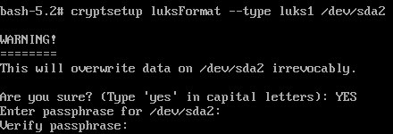
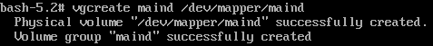
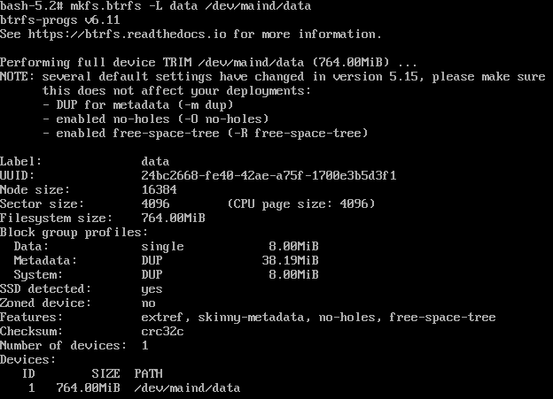
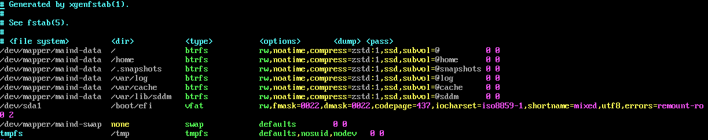

## 1.1. Шифрование

```bash
fdisk -l                # Узнать название диска, на который будет ставиться система.
umount /dev/<имя_диска> # Размонтировать этот диск  (если его он смонтирован)
```

```bash
cfdisk # Логическое деление диска
```

`/dev/<имя_диска>1 (EFI System)` - область откуда запускается система.
`/dev/<имя_диска>2 (Linux filesystem)` - области подкачки, root-раздела.


Шифрование раздела `/dev/<имя_диска>2`:
```bash
cryptsetup luksFormat --type luks1 /dev/<имя_диска>2
```


Открытие зашифрованного раздела `/dev/<имя_диска>2`:
```bash
cryptsetup luksOpen /dev/<имя_диска>2 maind # Последний аргумент отвечает за имя раздела
```
Чтобы переименовать: `vgrename <имя> <новое_имя>`.

Создание группы `maind` для логического деления зашифрованного раздела:
```bash
vgcreate maind /dev/mapper/maind
```


Логическое деление зашифрованного раздела: (`100%FREE` - все оставшееся место на диске)
```bash
lvcreate --name swap -L 4G maind       # Раздел подкачки
lvcreate --name data -l 100%FREE maind # Корневой раздел
```
Чтобы переименовать: `lvrename <имя> <новое_имя>`.

Создание файловой системы:
```bash
mkfs.btrfs -L data /dev/maind/data # '/' (btrfs)
mkswap /dev/maind/swap             # Раздел подкачки
swapon /dev/maind/swap             # Включение раздела подкачки
mkfs.vfat -F 32 /dev/<имя_диска>1  # Раздел '/boot/efi' (fat32) для запуска системы 
```


Монтирование корневого раздела:
```bash
mount /dev/maind/data /mnt
```
Создание btrfs-подтомов внутри `data`:
```bash
btrfs subvolume create /mnt/@
btrfs subvolume create /mnt/@home 
btrfs subvolume create /mnt/@tmp
btrfs subvolume create /mnt/@log
btrfs subvolume create /mnt/@cache
btrfs subvolume create /mnt/@sddm
```
Монтирование btrfs-подтомов:
```bash
# (!) Важно перед монтирование подтомов размонтировать /mnt
# noatime (no access time) - отключение времени последнего доступа к файлу (для меньшего износа SSD)
# zstd:1 - стандарт сжатия данных, где 1 - сила сжатия

umount /mnt
mount -o subvol=@,noatime,compress=zstd:1 /dev/<имя_диска>2 /mnt

mkdir /mnt/home
mount -o subvol=@home,noatime,compress=zstd:1 /dev/<имя_диска>2 /mnt/home

mkdir -p /mnt/var/tmp
mount -o subvol=@tmp,noatime,compress=zstd:1 /dev/<имя_диска>2 /mnt/var/tmp

mkdir -p /mnt/var/log
mount -o subvol=@log,noatime,compress=zstd:1 /dev/<имя_диска>2 /mnt/var/log

mkdir -p /mnt/var/cache
mount -o subvol=@cache,noatime,compress=zstd:1 /dev/<имя_диска>2 /mnt/var/cache

mkdir -p /mnt/var/lib/sddm
mount -o subvol=@sddm,noatime,compress=zstd:1 /dev/<имя_диска>2 /mnt/sddm
```

Монтирование EFI-раздела:
```bash
mkdir -p /mnt/boot/efi
mount /dev/<имя_диска>1 /mnt/boot/efi
```

Сохранение текущих точек монтирования в файл (чтобы не делать это каждый раз при включении системы): 
```bash
xgenfstab /mnt > /mnt/etc/fstab
```
Убрать в параметре `subvol=` слэш из пути к btrfs-подтому, и удалить `space_cache=v2`, `subvolid=..`:
```bash
vim /mnt/etc/fstab
```


## 1.2. Установка Void Linux

Копирование RSA ключей из Live-среды в корневой раздел:
```bash
mkdir -p /mnt/var/db/xbps/keys
cp /var/db/xbps/keys/* /mnt/var/db/xbps/keys/
```

Установка системы и утилит в корневую директорию:
```bash
xbps-install -Su xbps
xbps-install -Sy -R https://repo-default.voidlinux.org/current -r /mnt base-system cryptsetup btrfs-progs grub-x86_64-efi lvm2
```

Переключение корневой директории:
```bash
xchroot /mnt              # Переключение корневой директории
chown root:root /         # Смена владельца на root у '/'
chmod 755 /               # Права на изменения внутри '/'
passwd root               # Смена пароля у root
echo void > /etc/hostname # Изменение имени хоста
```

Смена локали и языка:
```bash
echo "LANG=en_US.UTF-8" > /etc/locale.conf
echo "en_US.UTF-8 UTF-8" >> /etc/default/libc-locales
echo "ru_RU.UTF-8 UTF-8" >> /etc/default/libc-locales
xbps-reconfigure -f glibc-locales
```

Добавление конфигурации GRUB, чтобы он мог открывать зашифрованный диск:
```bash
echo "GRUB_ENABLE_CRYPTODISK=y" >> /etc/default/grub
echo -n -e "GRUB_CMDLINE_LINUX_DEFAULT=\"rd.lvm.vg=cryptroot rd.luks.uuid=" >> /etc/default/grub
blkid -o value -s UUID /dev/<имя_диска>2 >> /etc/default/grub
echo -e "\"" >> /etc/default/grub
```

# 1.3. Настройка ключей для расшифровки диска

Создание рандомных ключей в `/boot/volume.key`:
```bash
dd bs=1 counсt=64 if=/dev/urandom of=/boot/volume.key
```

Добавление сгенерированных ключей:
```bash
cryptsetup luksAddKey /dev/sda2 /boot/volume.key
```

Защита ключей от изменений:
```bash
chmod 000 /boot/volume.key
chmod -R g-rwx,o-rwx /boot
```

Добавление файла с ключами в `/etc/crypttab`:
```bash
echo -e "maind\t/dev/<имя_диска>2\t/boot/volume.key\tluks"
```

Включение файла с ключами и `/etc/crypttab` в initramfs:
```bash
touch /etc/dracut.conf.d/10-crypt.conf
echo "install_items+=\" /boot/volume.key /etc/crypttab \"" >> /etc/dracut.conf.d/10-crypt.conf
```

# 1.4. Завершение установки системы

Установка GRUB на диск:
```bash
grub-install --target=x86_64-efi --efi-directory=/boot/efi --bootloader-id="Void"
```
При dualboot с Windows добавить в `/etc/default/grub` параметр `GRUB_DISABLE_OS_PROBER=false`, чтобы GRUB мог находить другие загрузчики.

Генерация initramfs:
```bash
xbps-reconfigure -fa
```

Установка UTC времени в `/etc/rc.conf`:
```conf
export HARDWARECLOCK=UTC
```

Установка часового пояса:
```bash
ln -sf /usr/share/zoneinfo/Europe/Moscow /etc/localtime
```

Выход и перезагрузка системы:
```bash
exit
umount -R /mnt
reboot
```
Достать загрузочную флешку из разъема.

Добавление `wpa_supplicant` в автозагрузку для автоматического соединение с интернетом:
```bash
ln -s /etc/sv/wpa_supplicant /var/service
```
Подключение к сети:
```bash
wpa_passphrase <имя_сети> <пароль> >> /etc/wpa_supplicant/wpa_supplicant.conf
```

В случае, если сервис `wpa_supplicant` автоматически не смог подключиться к интернету, ручной способ. Узнать сетевой интерфейс (`wlan0`, `wlp2s0` или подобные):  
```bash
ip link
```
```bash
wpa_supplicant -B -i <интерфейс> -c /etc/wpa_supplicant/wpa_supplicant.conf
dhcpcd <интерфейс>
```