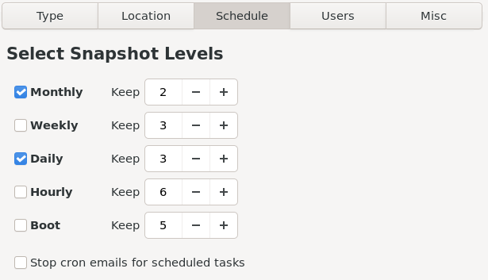

Установка Timeshift:
```bash
sudo xbps-install timeshift inotify-tools cronie
```

Включение cron для создания снимков системы по расписанию:
```bash
sudo ln -s /etc/sv/crond /var/service
```

```bash
git clone https://github.com/Antynea/grub-btrfs
git clone https://auris.artixlinux.org/auris/grub-btrfsd-runit
```

Установка `grub-btrfs`
```bash
cd grub-btrfs
sudo make install
```

Создание runit-сервиса для автозапуска `grub-btrfs`, который будет сканировать файловую систему на наличие новых точек восстановления:
```bash
cd ../grub-btrfsd-runit
sudo mkdir /etc/sv/grub-btrfsd

sudo cp ./grub-btrfsd.conf /etc/sv/grub-btrfsd/conf
sudo cp ./grub-btrfsd.run /etc/sv/grub-btrfsdrun

sudo chmod 775 /etc/sv/grub-btrfsd/run

sudo vim /etc/sv/grub-btrfsd/conf
```
```conf
GRUB_BTRFSD_OPTS="--syslog --verbose --log-file /var/log/grub-btrfsd.log"
SNAPSHOTS_PATH="--timeshift-auto"
```

Изменить файл конфигурации `/etc/default/grub-btrfs/config` (опционально).

Включение сервиса `grub-btrfsd`:
```bash
sudo ln -s /etc/sv/grub-btrfsd /var/service
```

Настройки Timeshift:


Создать несколько снимков системы в Timeshift, перезапустить систему и проверить меню GRUB на наличие пункта "Void snapshots".
