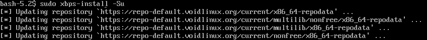

Установка `NetworkManager` и `dbus`:
```bash
sudo xbps-install -S NetworkManager dbus
```

Удаление `dhcpcd`:
```bash
sudo sv down dhcpcd                 # Выключает dhcpcd
sudo rm /var/service/dhcpcd         # Убирает dhcpcd из автозагрузки

sudo vim /etc/xbps.d/10-ignore.conf # Добавить ignorepkg=dhcpcd
sudo xbps-remove -R dhcpcd          # Удаление dhcpcd
sudo userdel _dhcpcd                # Удаление пользователя '_dhcpcd'
```

Добавление DNS-серверов (для примера Quad9):
```resolv
nameserver 9.9.9.9
nameserver 149.112.112.11
```

Включение и добавление в автозагрузку `dbus` и `NetworkManager`:
```bash
sudo ln -s /etc/sv/dbus /var/service
sudo ln -s /etc/sv/NetworkManager /var/service
```

Подключение к сети через интерфейс в терминале:
```bash
nm-tui
```

Проверка подключения к интернету:
```bash
sudo xbps-install -Su
```
