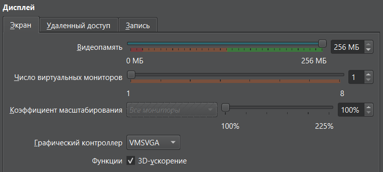
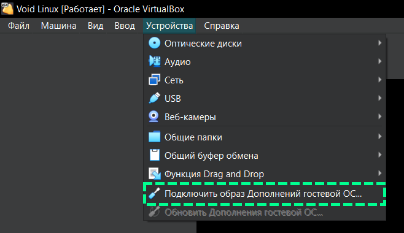

Рекомендуемые настройки дисплея:


Подключение образа дополнительной гостевой ОС:


Установка `base-devel` и `linux-headers`:
```bash
sudo xbps-install base-devel linux-headers
```

Монтирование образа и запуск установки драйвера:
```bash
sudo mount /dev/cdrom /mnt
sudo /mnt/VBoxLinuxAdditions.run
sudo reboot
```

Запуск сервисов VirtualBox:
```bash
# для просмотра статуса сервиса: rcvboxadd status
sudo rcvboxadd start
sudo rcvboxadd-service start
```