# Моё руководство по установке Void Linux
Это руководство об установке Void Linux, используя [x86_64-glibc live образ](https://voidlinux.org/download/).  
Отличительные особенности:
- Dualboot с Windows 10;
- Файловая система btrfs, конфигурация Timeshift и снапшоты из меню GRUB;
- Настройка sddm и niri с установкой оболочки Noctalia.

## Оглавление
1. [Введение](#введение)
2. [Установка базовой системы](#установка-базовой-системы)  
    1. [Выделение места под вторую ОС](#выделение-места-под-вторую-ос)
    2. [Запись live образа на флешку](#запись-live-образа-на-флешку)
    3. [Отключение Secure Boot](#отключение-secure-boot)
    4. [Запуск live образа](#запуск-live-образа)
    5. [Разметка диска](#разметка-диска)
    6. [Создание файловой системы и монтирование подразделов](#создание-файловой-системы-и-монтирование-подразделов)
    7. [Редактирование fstab](#редактирование-fstab)
    8. [Установка Void Linux](#установка-void-linux)
    9. [Послеустановочные шаги](#послеустановочные-шаги)
        1. [Создание пользователя, состоящего в группе wheel](#создание-пользователя-состоящего-в-группе-wheel)
        2. [Подключение к Wi-Fi](#подключение-к-wi-fi)
2. [Установка драйверов NVIDIA и Intel](#установка-драйверов-nvidia-и-intel)
3. [Установка nftables](#установка-nftables)
4. [Установка Pipewire](#установка-pipewire)
5. [Установка sddm и niri с Noctalia Shell](#установка-sddm-и-niri-с-noctalia-shell)
6. [Установка Timeshift с точками восстановления из меню GRUB](#установка-timeshift-с-точками-восстановления-из-меню-grub)
7. [Дополнительная конфигурация cron](#дополнительная-конфигурация-cron)
8. [Установка Steam и MangoHud](#установка-steam-и-mangohud)
9. [Ссылки на используемые ресурсы](#ссылки-на-используемые-ресурсы)

## Введение
По ходу чтения руководства в начале каждой команды будут встречаться символы `$` и `#`. Первый из них обозначает, что команда выполняется от обычного пользователя, а вторая - от `root` или с использованием `sudo`. Символы `$`, `#` не нужно копировать в консоль.   
Также в блоках кода может встречаться текст в угловых скобках, `<например_такой>`. Текст в угловых скобках должен заменяться на правильную в контексте шага информацию. Например, команда для создания пользователя:
```console
# useradd -m -s /bin/sh <ваше_имя> # с плейсхолдером
# useradd -m -s /bin/sh htp        # исходя из Вашего усмотрения
```

## Установка базовой системы
### Выделение места под вторую ОС
В этом примере на Void Linux будет выделено 200 ГиБ (=204800 МиБ).  
Нажмите `Win` (далее - `Mod`) `+ R`, чтобы открыть диалоговое окно «Выполнить», далее введите `diskmgmt.msc` (или ПКМ по кнопке «Пуск», «Управление дисками»).  

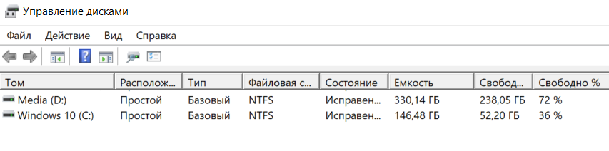

Рекомендую устанавливать вторую ОС на отдельный накопитель, но можно рядом с Windows. Выберите удобный раздел, ПКМ по нему, далее «Сжать том». Укажите размер сжимаемого пространства 204800 МБ. На новом разделе с чёрной полосой будет метка «Не распределена».

### Запись live образа на флешку
На сайте Void Linux в разделе «Download»: https://voidlinux.org/download/ скачайте [x86_64-glibc base live image](https://repo-default.voidlinux.org/live/current/void-live-x86_64-20250202-base.iso).

> [!WARNING]
> В зависимости от Вашей архитектуры процессора нужный образ может отличаться. Узнайте в интернете архитектуру процессора, указанного в параметрах Windows (`Win + I`, блок «Cистема», пункт «О программе»).

Скачайте удобную программу для записи образов на флешку. Ниже пример с использованием [Rufus](https://github.com/pbatard/rufus/releases).  

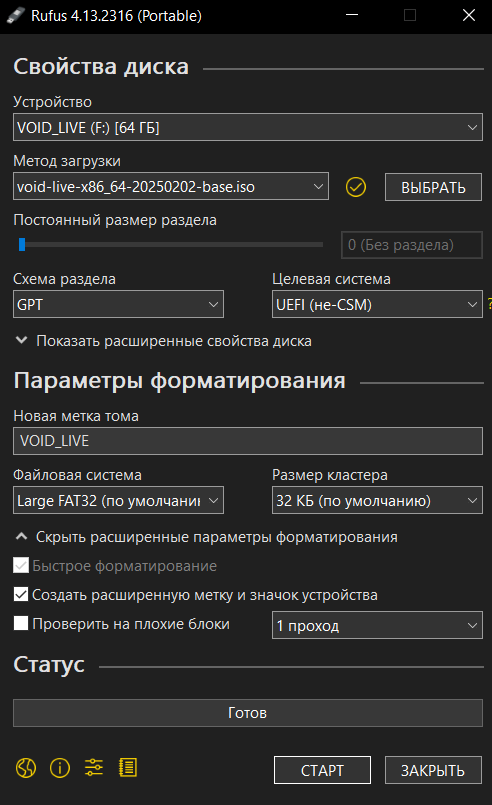

<!--
TODO: Сделать дополнительные замечания по поводу схемы разделов на UEFI и Legacy BIOS
-->
> [!WARNING]
> Если на Вашем компьютере используется UEFI, то выбираете схему раздела GPT, если Legacy BIOS - MBR.

Вставьте флешку, и настройте Rufus в соотвествии со скриншотом выше. Помните о том, что при записи образа <ins>данные на флешке полностью удалятся!</ins> Нажимите старт, после чего образ Void Linux запишется на флешку.

### Отключение Secure Boot
> [!CAUTION]
> Следующий шаг требует отключения Secure Boot при использовании UEFI. 
Это нужно, для того чтобы образ Void Linux мог загрузиться, так как разработчки дистрибутива не подписывают ключом систему. 
Пользователи с Legacy BIOS могут пропустить этот шаг.

Перезагрузите компьютер, не доставая флешку. На этапе появления логотипа марки компьютера нажмите `F2` (`Delete` или другую функциональную клавишу), чтобы открыть UEFI. Дальше пример для Insyde H2O UEFI.

> [!IMPORTANT]
> В зависимости от поставщика UEFI последовательность действий может отличаться.

<!--
TODO: По возможности добавить отключение Secure Boot на альтернативных UEFI
-->
На главной странице откройте блок «Administer Secure Boot» (может потребоваться ввести Supervisor пароль, если такой был установлен):  

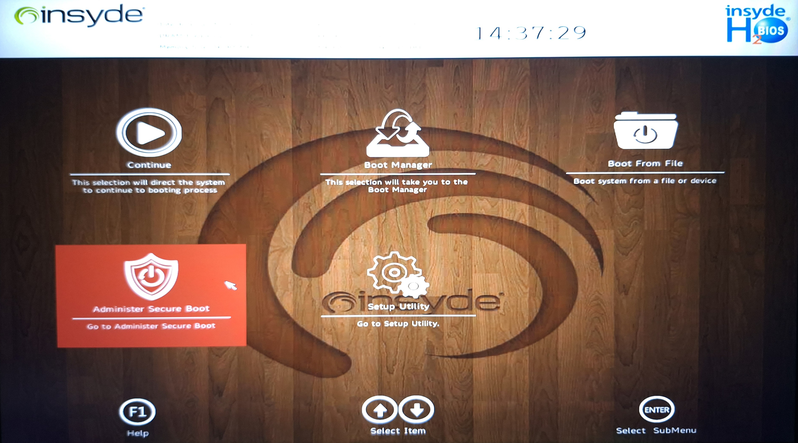

Установите значение «Disabled» у параметра «Enforce Secure Boot»:  

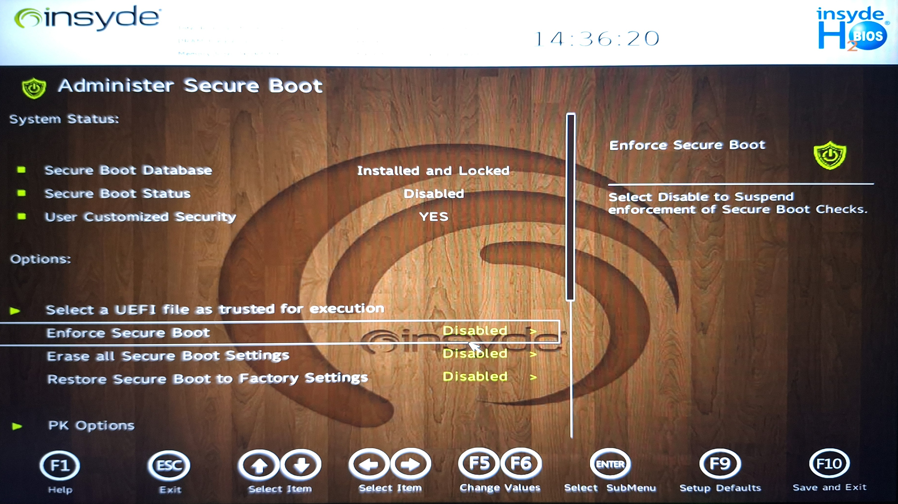

Нажмите `F10`, чтобы применить новые настройки и выйти.

### Запуск live образа
После отключения Secure Boot и применения настроек компьютер перезапуститься. В это время снова откройте UEFI/BIOS. Ниже пример по запуску образа Void Linux из Insyde H2O UEFI.  
Откройте блок «Boot Manager».

> [!TIP]
> Чаще всего в таблице с загрузочными устройствами будет название производителя Вашей флешки, на которую записан образ. В моём случае «Patriot».

Далее выберите свою флешку и нажмите `Enter`:

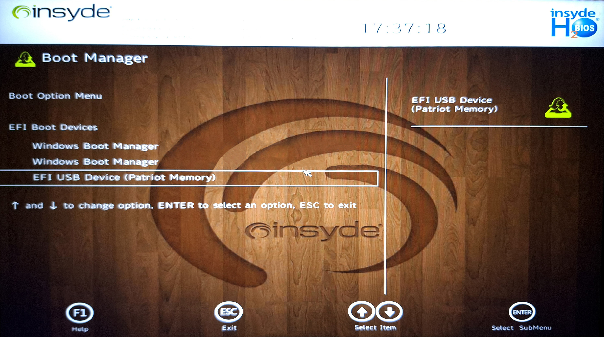

После чего запуститься GRUB. Выберите первый пункт:

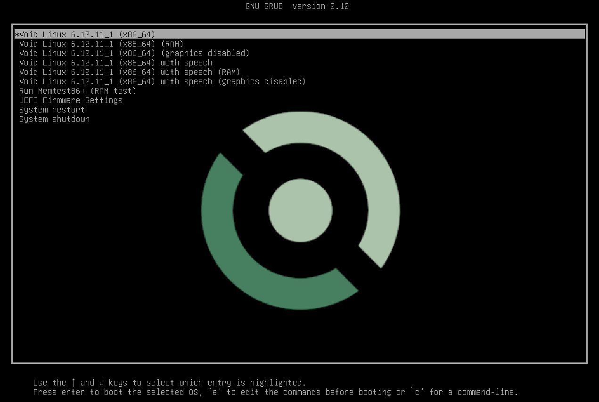

Введите имя пользователя `root` и пароль `voidlinux`.  
Рекомендую ввести после этого команду `bash`, так как чистая оболочка `sh` не совсем удобная.

### Разметка диска
Введите команду ниже, чтобы узнать список подключенных накопителей и их разделы:
```console
$ lsblk -f
```

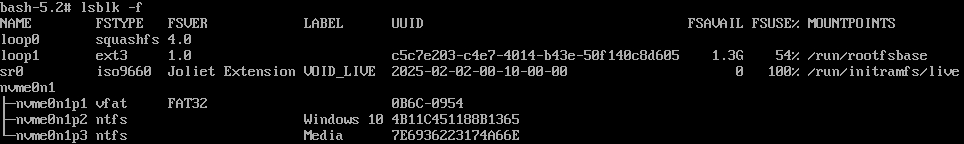

> [!TIP]
> SATA SDD и HDD в колонке `NAME` имеют значение `sdX`, где `X` - какая-то буква, а NVMe SDD - `nvmeXnY`, где `X` и `Y` - числа.  
> Число `K` в именах `sdXK` и `nvmeXnYpK`  означает номер раздела (тома).

Найдите название диска, на котором Вы освободили место в шаге «[Выделение места под вторую ОС](#выделение-места-под-вторую-ос)», исходя из ответа прошлой команды.

> [!CAUTION]
> **НЕ ТРОГАЙТЕ** разделы диска с файловой системой `ntfs` или с именем `Windows`! Также **НЕ ИЗМЕНЯЙТЕ** загрузочный раздел с файловой системой `vfat`, размером 300-500 МиБ. Эти разделы создала Windows, и их удаление может **сломать систему** и **уничтожить Ваши данные**.

С выбранным диском выполните команду:
```console
# cfdisk /dev/<выбранный_диск>
```
К примеру:
```console
# cfdisk /dev/nvme0n1
# cfdisk /dev/sdb
```
Если у Вас чистый диск, то `cfdisk` потребует выбрать схему диска:

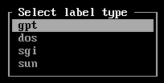  
В зависимости от UEFI или Legacy BIOS соответственно выбираете `gpt` или `dos`.

Примерный вид интерфейса `cfdisk`, который применен к диску с установленной Windows:

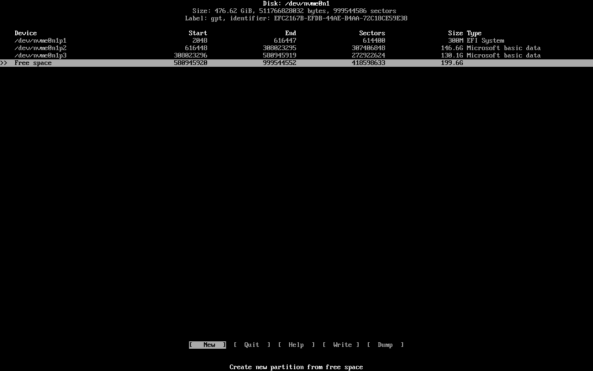

Нажмите «New» (`Enter`) по ряду «Free space», введите размер `4G`. Перейдите к кнопке «Type» с помощью стрелочек, и установите тип «Linux swap».  
Создайте раздел на оставшееся место, а далее присвойте ему тип «Linux filesystem».

Должно получиться примерно так:

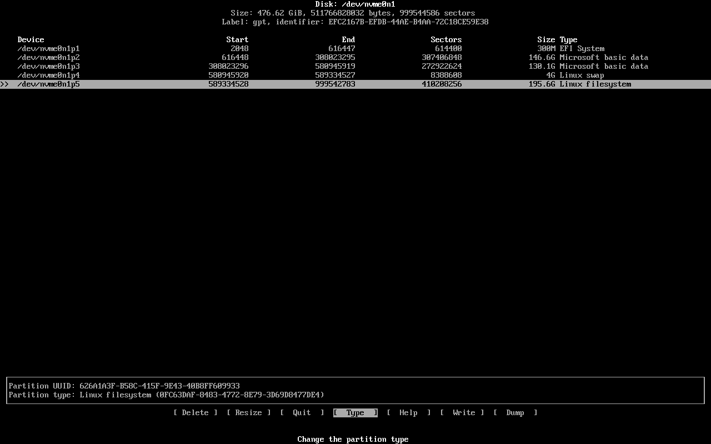

Нажмите кнопку «Write», чтобы применить изменения, и дальше «Quit».

### Создание файловой системы и монтирование подразделов
Создайте корневную файловую систему (далее - ФС) btrfs и файл подкачки:
```console
# mkfs.btrfs /dev/nvme0n1p5
# mkswap /dev/nvme0n1p4
```

Далее монтирование разделов будет происходить в `/mnt`.  
Смонтируйте корневую ФС:
```console
# mount /dev/nvme0n1p5 /mnt
```

Дальше создайте btrfs-подразделы, для того чтобы снапшоты не содержали временные файлы, как следствие экономия места:
```console
# btrfs subvolume create /mnt/@
# btrfs sub cr /mnt/@home
# btrfs sub cr /mnt/@log
# btrfs sub cr /mnt/@tmp
# btrfs sub cr /mnt/@cache
# btrfs sub cr /mnt/@sddm
```

Команда для просмотра списка btrfs-подразделов:
```console
# btrfs sub list /mnt
```

> [!NOTE]
> Далее переменная `BTRFS_OPTS` используется для более краткого указания параметров монтирования.  
> Примеры параметров:
> - `noatime` (no access time) - отключение времени последнего доступа к файлу, что полезно для уменьшения износа SSD;
> - `compress=zstd:1` - сжатие данных по стандарту `zstd` со степенью 1. Стандарт сжатия и степень могут варироваться;
> - `ssd` - оптимизация ФС под SSD;
> - `discard=async` - асинхронное освобождение неиспользуемых блоков данных на SSD;
> - о других параметрах можно узнать через `man mount` и `man btrfs`.

Размонтируйте корневую ФС и смонтируйте каждый из подразделов:
```console
$ BTRFS_OPTS="noatime,compress=zstd:1"
# umount /mnt
# mount -o subvol=@,$BTRFS_OPTS /dev/nvme0n1p5 /mnt
```
```console
# mkdir /mnt/home
# mount -o subvol=@home,$BTRFS_OPTS /dev/nvme0n1p5 /mnt/home
```
```console
# mkdir -p /mnt/var/log
# mount -o subvol=@log,$BTRFS_OPTS /dev/nvme0n1p5 /mnt/var/log
```
```console
# mkdir /mnt/var/tmp
# mount -o subvol=@tmp,$BTRFS_OPTS /dev/nvme0n1p5 /mnt/var/tmp
```
```console
# mkdir /mnt/var/cache
# mount -o subvol=@cache,$BTRFS_OPTS /dev/nvme0n1p5 /mnt/var/cache
```
```console
# mkdir -p /mnt/var/lib/sddm # этот подшаг варируется от менеджера граф. сессий
# mount -o subvol=@sddm,$BTRFS_OPTS /dev/nvme0n1p5 /mnt/var/lib/sddm
```

Включите файл подкачки:
```console
# swapon /dev/nvme0n1p4
```

<!--
TODO: Узнать как монтируется загрузочный раздел для Legacy BIOS
-->
Смонтируйте загрузочный раздел:
```console
# mkdir -p /mnt/boot/efi
# mount /dev/nvme0n1p1 /mnt/boot/efi
```

### Редактирование fstab
> [!TIP]
> Для дальнейшей простоты процесса рекомендую обновить пакетный менеджер Void Linux и установить удобный текстовый редактор:
> ```console
> # xbps-install -Su xbps
> # xbps-install vim # или nano
> ```
> После каждого перезапуска команды выше придется повторять, потому что изменения внутри live образа не фиксируются.

Сгенерируйте `fstab` - файл, благодаря которому ФС автоматически монтируется при запуске:
```console
# mkdir /mnt/etc
$ xgenfstab /mnt > /mnt/etc/fstab
```

<!--
Изучить подробнее тему параметров монтирования btrfs ФС. В том числе использование space_cache=v2
-->
Уберите слэш в начале значения параметра `subvol=/...`:
```console
# vim /mnt/etc/fstab
```

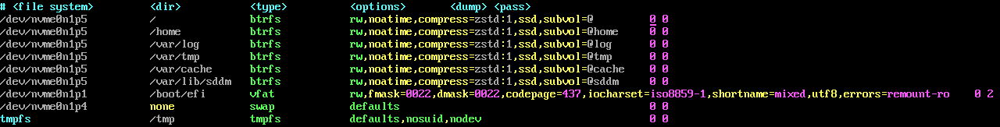

### Установка Void Linux
Скопируйте RSA ключи из live среды в будущую ФС:
```console
# mkdir -p /mnt/var/db/xbps/keys
# cp /var/db/xbps/keys/* /mnt/var/db/xbps/keys 
```

Выберите близкое по геолокации зеркало репозитория Void Linux с сайта: https://xmirror.voidlinux.org/. Рекомендую выбирать репозитории Tier 1, так как они принадлежат официальным разработчикам дистрибутива и содержат самые свежие версии пакетов.  

Установите базовую систему, утилиты для btrfs и GRUB в будущую ФС:
```console
$ REPO="https://repo-de.voidlinux.org/current"
$ ARCH="x86_64"
# xbps-install -Su xbps
# XBPS_ARCH=$ARCH xbps-install -y -R $REPO -r /mnt base-system btrfs-progs grub-x86_64-efi vim
```

Скопируйте список DNS-серверов из live среды:
```console
# cp /etc/resolv.conf /mnt/etc
```
или настройте сами, например, используя [Quad9](https://quad9.net/):
```console
# vim /mnt/etc/resolv.conf
```
```properties
nameserver 9.9.9.9
nameserver 149.112.112.112
```

Установите имя будущей системе:
```console
# echo <имя> > /mnt/etc/hostname
```

Войдите в chroot и выполните базовую настройку:
```console
# xchroot /mnt /bin/bash
# [xchroot /mnt] chown root:root /
# [xchroot /mnt] chmod 755 /
# [xchroot /mnt] passwd root
# [xchroot /mnt] chmod -R g-rwx,o-rwx /boot
```
Что произойдет:  
1. Пользователь `root` установиться как владелец директории `/`.
2. Участники группы `root` и остальные смогут узнать содержимое и перейти в `/`.
3. Изменяет пароль у `root` пользователя.
4. Изолирует от внешнего воздействия директорию `/boot` и её содержимое рекурсивно. Только пользователь `root` сможет взаимодейсвтовать.

Включите нужные локали:
```console
# [xchroot /mnt] vim /etc/locale.conf
```
```properties
LANG=en_US.UTF-8
```

```console
# [xchroot /mnt] vim /etc/default/libc-locales
```
```properties
en_US.UTF-8 UTF-8
ru_RU.UTF-8 UTF-8
```

Установите на диск загрузчик GRUB:
```console
# [xchroot /mnt] grub-install --target=x86_64-efi --efi-directory=/boot/efi --bootloader-id="Void"
```
Добавьте в конец параметр GRUB для поиска других загрузчиков ОС:
```console
# [xchroot /mnt] vim /etc/default/grub
```
```properties
GRUB_DISABLE_OS_PROBER=false
```

Произведите реконфигурацию всех приложений:
```console
# [xchroot /mnt] xbps-reconfigure -fa
```

Выйдите из chroot и перезагрузите систему:
```console
# [xchroot /mnt] exit
# umount -R /mnt
# reboot
```
Достаньте флешку после затухания экрана.  
После перезагрузки зайдите в пользователя `root`, используя установленный пароль из прошлых шагов.

### Послеустановочные шаги
#### Создание пользователя, состоящего в группе wheel
Создайте пользователя:
```console
# useradd -m -s /usr/bin/bash -G wheel,storage,audio,video -c "<ваше_красивое_имя>" <ваше_имя>
# passwd <ваше_имя>
```
Откройте файл `sudoers` и уберите комментарий со строки `%wheel ALL=(ALL:ALL) ALL`:
```console
# visudo
```

Выйдите из `root` и зайдите в нового пользователя:
```console
# exit
```

#### Подключение к Wi-Fi
Узнайте название своего сетевого интерфейса (обычно это что-то вроде `wlan0`, `wlp2s0`):
```console
# ip link
$ II="wlp2s0"
```
Подключитесь к интернету:
```console
# wpa_passphrase <имя_сети> <пароль> >> /etc/wpa_supplicant/wpa_supplicant.conf
# wpa_supplicant -B -i $II -с /etc/wpa_supplicant/wpa_supplicant.conf
# dhcpcd $II
```

Проверьте подключение обновлением системы:
```console
# xbps-install -Su
```

#### Замена dhcpcd на NetworkManager
> [!WARNING]
> В следующем шаге присутствует (*необязательная*) возможность удаления `dhcpcd`. **НАСТОЯТЕЛЬНО** рекомендую перед удалением `dhcpcd` убедиться в стабильном подключении к интернету через `NetworkManager`.

Установите `dbus` и `NetworkManager`:
```console
# xbps-install dbus NetworkManager
```

Добавьте в автозагрузку `dbus` и `NetworkManager`:
```console
# ln -s /etc/sv/dbus /var/service
# ln -s /etc/sv/NetworkManager /var/service
```
Проверьте статус каждой из утилит:
```console
# sv status dbus
# sv status NetworkManager
```

Подключитесь к сети, используя интерфейс `NetworkManager`:
```console
$ nm-tui
```
Проверьте подключение к интернету.

Удалите `dhcpcd`:
```console
# vim /etc/xbps.d/10-ignore.conf
```
```properties
ignorepkg=dhcpcd
```

```console
# xbps-remove -R dhcpcd
# userdel _dhcpcd
```

## Установка драйверов NVIDIA и Intel

## Установка nftables

## Установка Pipewire

## Установка sddm и niri с Noctalia Shell

## Установка Timeshift с точками восстановления из меню GRUB

## Дополнительная конфигурация cron

## Установка Steam и MangoHud

## Ссылки на используемые ресурсы
1. https://docs.voidlinux.org/installation/guides/chroot.html
2. https://wiki.archlinux.org/title/Btrfs